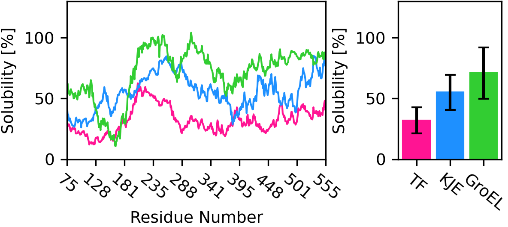

====
# Chape_pred

## Overview
ChapePred is a program which based on a machine-learning algorithm (DNN) to predict protein solubilities under the three protein chaperones (TF, DnaKJE, and GroEL/ES).  
  
  

## Description
To solve insoluble proteins, expressing protein chaperons is a typical solution. However, protein chaperones have different molecular mechanisms and preferable target proteins in their dissolution processes. Therefore, most researchers specify a suitable protein chaperon for a target by trial and error. To tackle this issue, we have developed a program named ChapePred to predict protein solubilities under various protein chaperones (TF, KJE, and GroEL).

## Requirement
・Python 3.x (3.7.8)  
・tensolflow(2.11.0)
・numpy (1.19.1)　   
・keras (2.11.0)  
・matplotlib(3.3.4 < 3.5)    
・scikit-learn (1.1.1)  

## Usage  
0. Create environment  
 conda create -n chapepred python=3.9  
1. Install dependency packages  
`conda install --file requirements.txt`  
OR  
Mannually install the python packages in the requirements.txt  
  
2. Prepare FASTA formatted sequence  
The file needs a single sequence and title line.  
Line breaks in sequence is allowed.  
  
3. Run Chapepred!  
`python chapepred.py input.fa`  
  
4. Result  
PNG image contains solubility around each residue and the average solubilities for three chaperones.  
Text file contains predicted solubility without chaperone,with TF, KJE, and GroEL.  
  
## Author  
T. Yasuda, R. Morita, Y. Shigeta, R. Harada  
Center for Computational Sciences, University of Tsukuba  
takunoriyasuda@gmail.com
